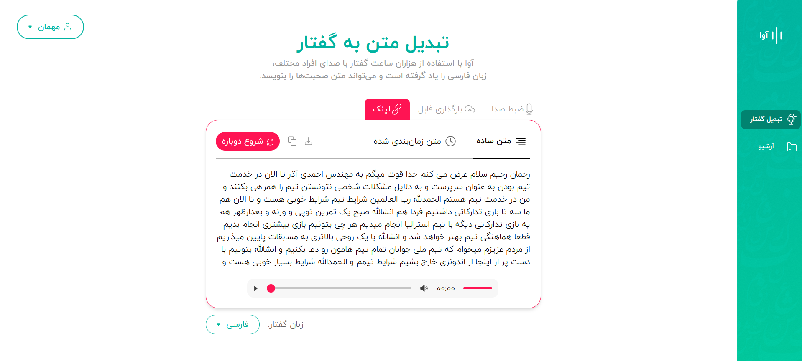
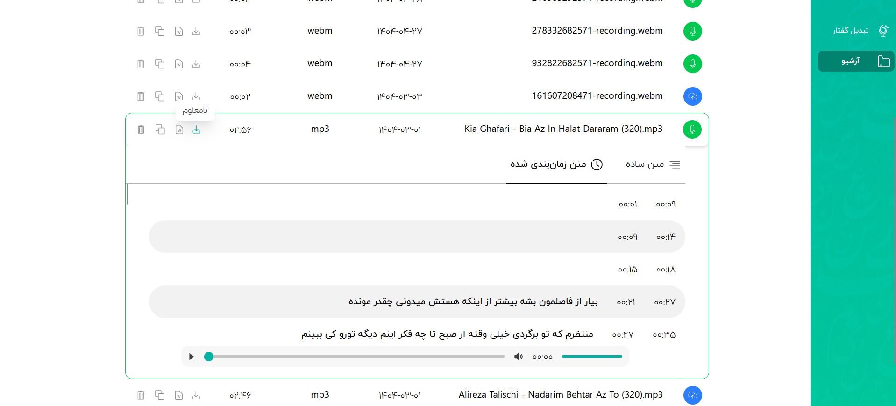

# 🎤 Ava Dashboard

**Ava** is a frontend project developed as part of the **Roshan internship**. It provides a simple and intuitive dashboard where users can **submit audio** and receive its **transcribed text** using speech-to-text capabilities.

---

## 🛠️ Technologies Used

- **React** – For building dynamic user interfaces
- **TypeScript** – Ensures type safety and better DX
- **TailwindCSS** – Utility-first CSS for styling
- **MSW (Mock Service Worker)** – Mocks backend APIs during development

---

## 📄 Example Pages

| Page             | Description                                                   | Preview                          |
|------------------|---------------------------------------------------------------|----------------------------------|
| **Speech-to-Text** | Upload audio files and view real-time transcriptions         |  |
| **Archive**        | Browse previously submitted audios and their text output     |                |

---

## 🚀 Getting Started

To run Ava locally, follow these steps:

### 1. Clone the repository

```bash
git clone https://github.com/AriArash44/roshan-task
cd roshan-task
```
###  2. Create a .env file in the root directory with the following contents:

```bash
VITE_API_KEY=????
VITE_BYTESCALE_API_KEY=????
VITE_BASE_URL=https://harf.roshan-ai.ir/api
VITE_MOCK_URL=https://harf.roshan-ai.ir/mock/api
VITE_USE_MOCK=true
```

### 3. Install dependencies and run the app

```bash
npm install
npm run dev
```